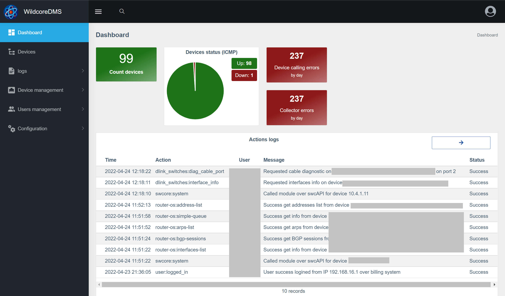
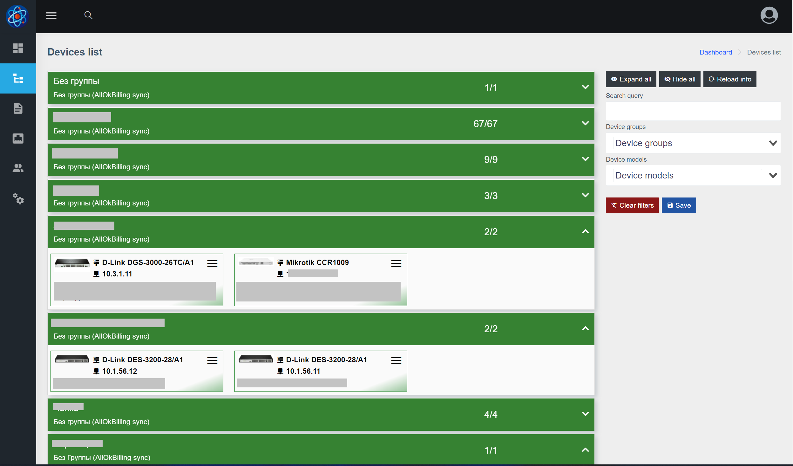
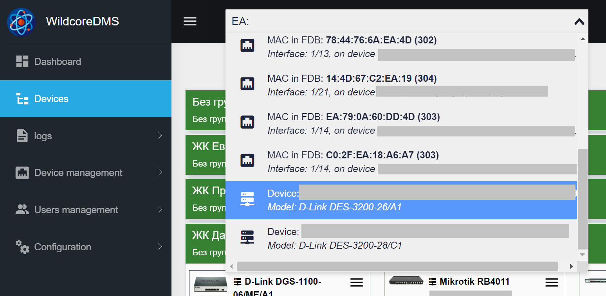
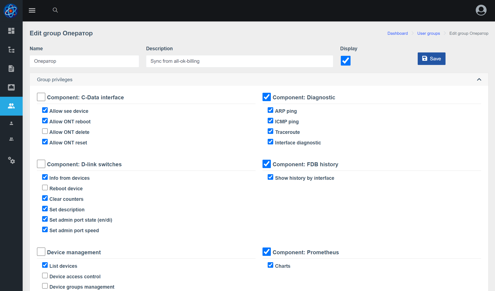
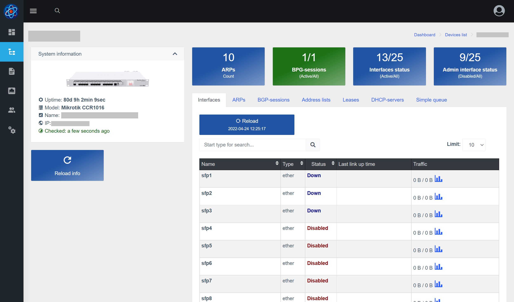
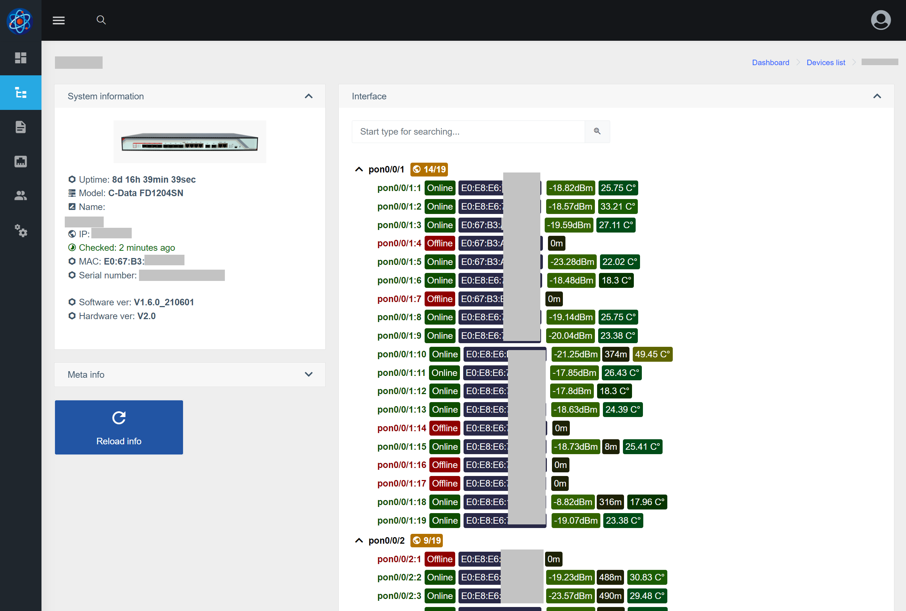
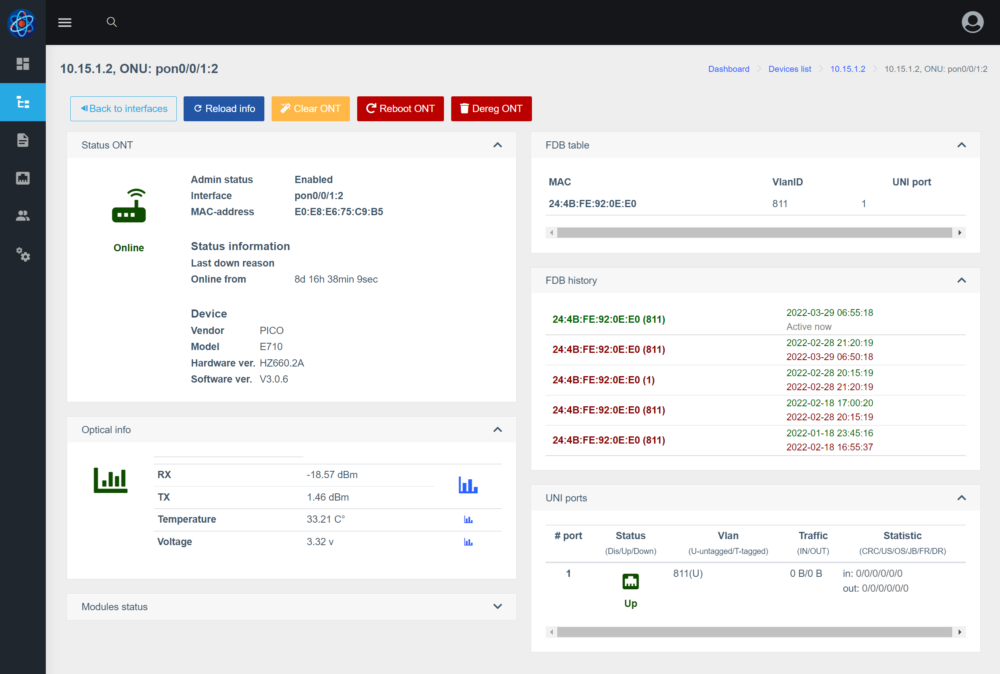
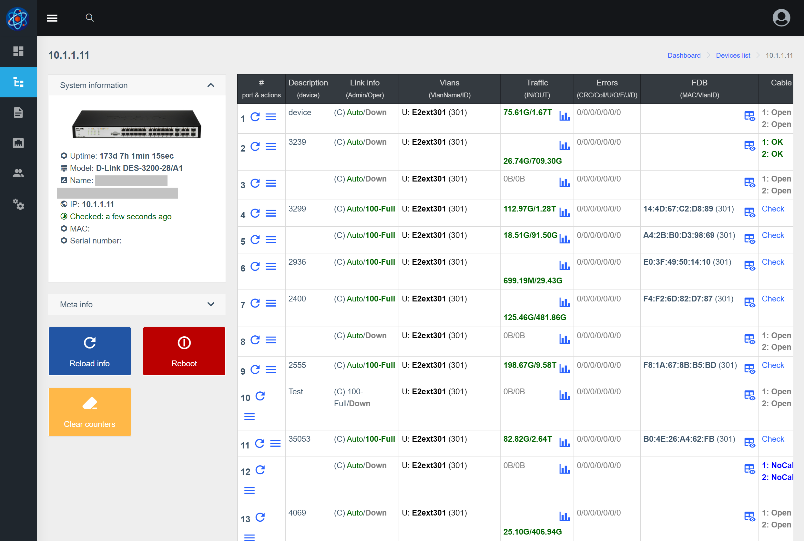
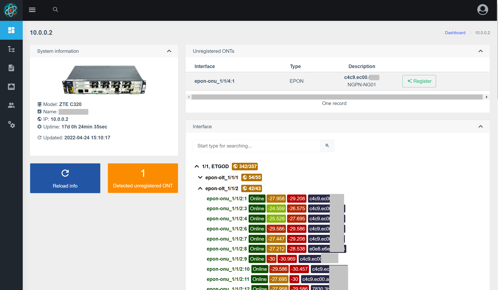
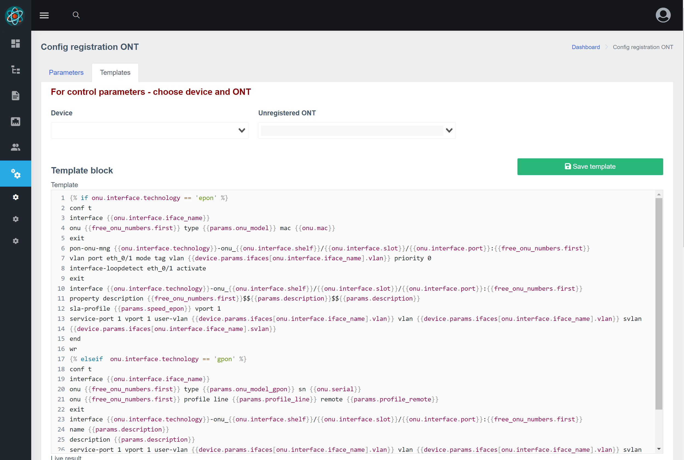

# Wildcore agent web panel screens

**Dashboard**    
Stat, last actions and another info 

    
**Device dashboard**    
List of devices, with groups and filters 

    
**Global searching**    
Global searching of device or client (FDB, ARP and another) 

    

**User-group edit**    
Config permissions page for group of users 
    
       
**Mikrotik device**    
Mikrotik device dashboard 

    
**C-Data device**    
C-Data OLT dashboard 

    
**C-Data ONU**    
ONU on C-Data OLT dashboard 

    

**Dlink switch**    
Dlink switch dashboard 

    

**ZTE dashboard**    
ZTE OLT dashboard 

**ZTE registration template**    
Page for configure ONT registration template 

    

