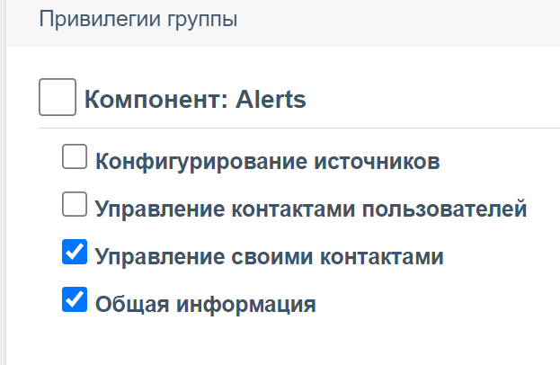
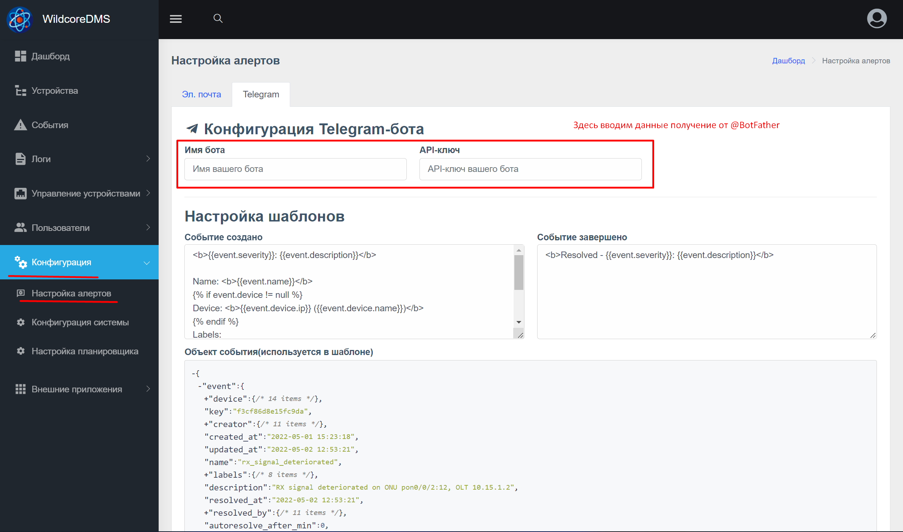
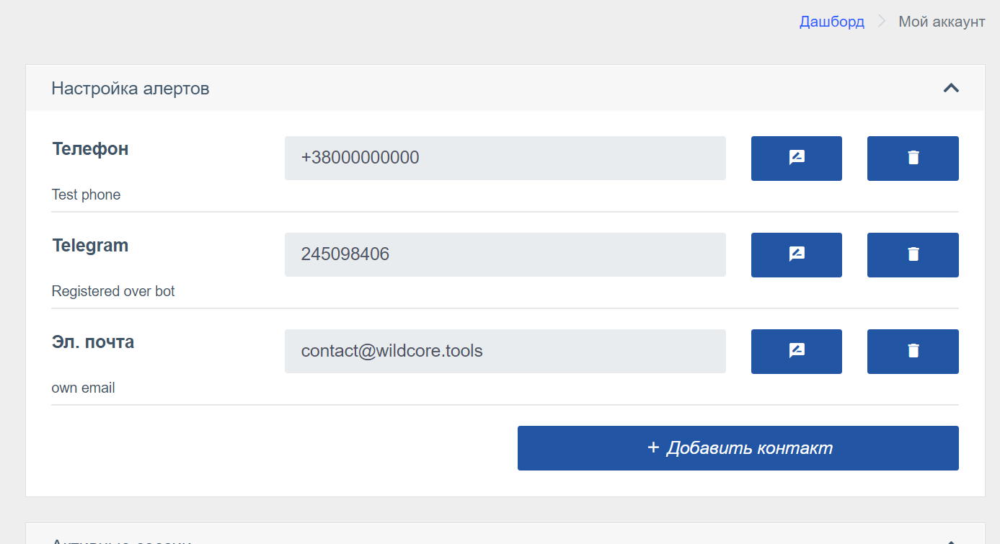
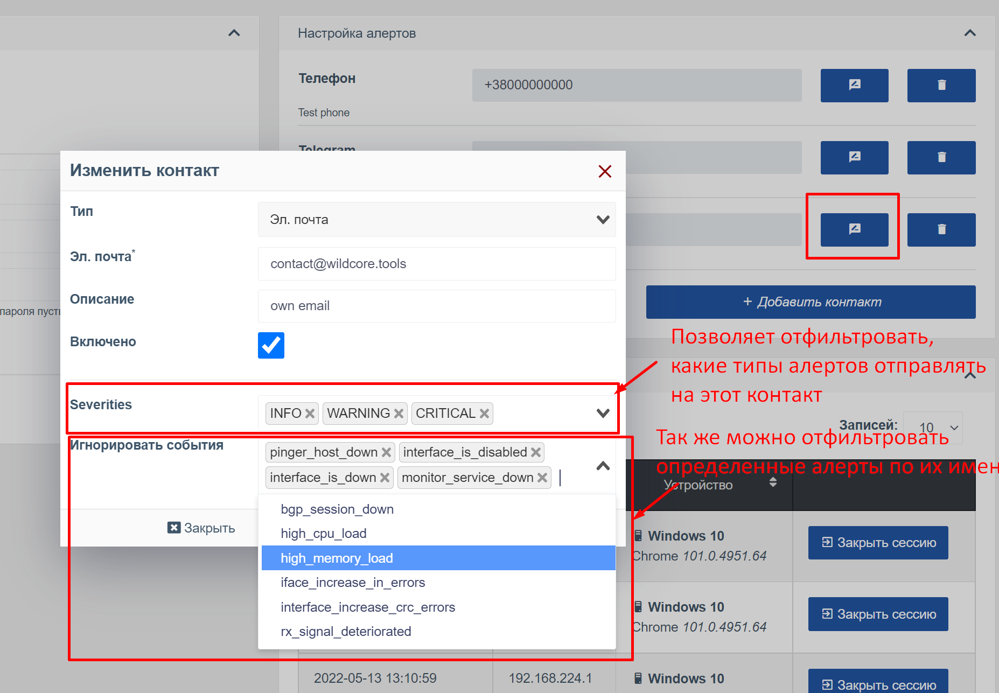

# Уведомления (alerts)
Отправляет уведомления в телеграм и на электронную почту (при необходимости будет расширено)    
Внимание! Для работы этого компонента требуется установленный и включенный компонент [Events](./events.md)

## Включение компонента   
Компонент доступен с версии 0.5.23 и будет автоматически включен при обновлении.

## Конфигурирование компонета 
### Установите права доступа к компоненту
После установки, групам пользователей, при необходимости, через панель добавьте возможность управлять своими контактами. 
* Для администраторов/менеджеров     

*У системных групп эти права включены по-умолчанию*

* Для пользователей/операторов и т.д.        

*Обратите внимание, что права групп пользователей кешируются системой и они вступят в силу в течении 5и минут.*    
*Так же можно сбросить кеш командой `wca cache:flush` в консоли, что бы не ждать пока применятся изменения*   

## Конфигурирование источников    
Это способы отправки уведомлений, их несколько: 
* Telegram    
* Эл. почта    

### Конфигурирование источника telegram
1. Создать телеграм-бот через [@BotFather](https://t.me/BotFather).
2. После создания бота, перейдите на страницу конфигурации алертов и введите имя бота и полученный токен от @BotFather
   
3. Нажмите кнопку сохранить(внизу страницы) для применения изменений.       
Так же вы можете настроить содержимое сообщения, используя шаблоны.   
Используйте HTML теги для оформления текста.   
В качестве шаблонизатора используется Twig.     

### Конфигурирование источника Эл. почты 
Для работы требуется рабочий почтовый сервер с SMTP (с шифрованием TLS/SSL или без шифрования)    
На странице конфигурации вы увидите стандартные поля для подключения SMTP       
Для сообщений эл почты так же как и для телеграм, есть возможность настроить шаблоны, используйте HTML 

## Конфигурация контактов    
В карточке пользователя(для администраторов) или настройке аккаунта появится новый блок "настройка алертов".
     

Возможно добавить несколько типов контактов, некоторые контакты будут добавлены автоматически(например телеграм, при регистрации в боте)     
     
При добавлении нескольких контактов(например эл.почта и Telegram) уведомления будут разосланы по обоим контактам.    
Что бы как то разграничить отправку уведомлений, используйте фильтры в настройках контакта.     
      
