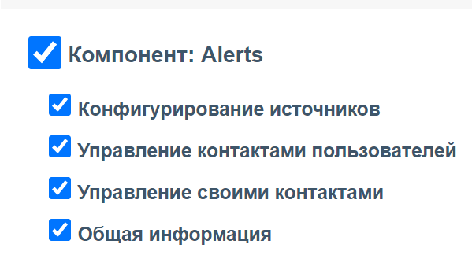

# Уведомления (alerts)
Отправляет уведомления в телеграм и на электронную почту (при необходимости будет расширено) 

## Включение компонента   
Компонент доступен с версии 0.5.21 и будет автоматически включен при обновлении.

## Конфигурирование компонета 
### Установите права доступа к компоненту
После установки, групам пользователей, при необходимости, через панель добавьте возможность управлять своими контактами. 
* Для администраторов/менеджеров    
   
*У системных групп эти права включены по-умолчанию*
     
     

* Для пользователей/операторов и т.д.      

*Обратите внимание, что права групп пользователей кешируются системой и они вступят в силу в течении 5и минут*    
*Так же можно сбросить кеш командой `wca cache:flush` в консоли, что бы не ждать пока применятся изменения*   

