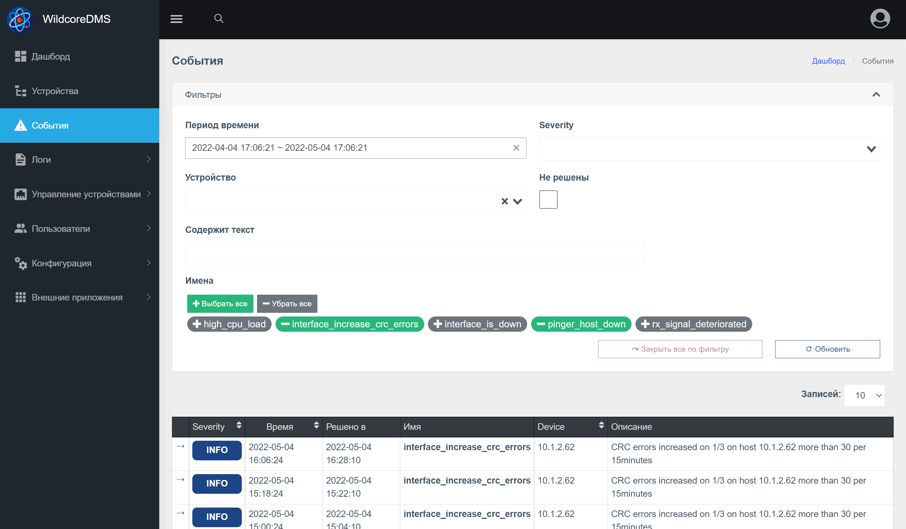
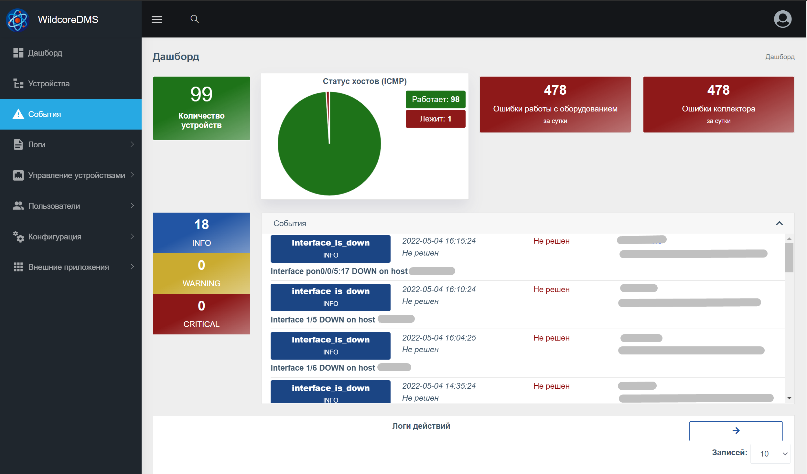

# Cобытия (events)
Данный компонент получает, обрабатывает и сохраняет события(изменения на оборудовании, в сети). 

## Источники событий
* alertmanager (https://prometheus.io/docs/alerting/latest/alertmanager/)   
* collector (при сборе показаний с оборудования)
* icmp-pinger (при обновлении состояния оборудования)

**Alertmanager**   
Позволяет так же создавать свои алерты, указав их в файле ./var/prometheus/custom.rules.yml (файл нужно будет создать).          
*Примеры, как создаются алерты можно посмотреть в официальной документации alertmanager, а так же посмотрев содержимое файла ./docker/prometheus/collector.rules.yml*

**Collector**   
Некоторые события, такие как bgp_session_down, генерируются коллектором.    
*Это заранее установленные события, как то управлять ими на данный момент невозможно*

**ICMP-pinger**   
Создает единственное событие - pinger_host_down, которое говорит о падении оборудования.   
*Это заранее установленные события, как то управлять ими на данный момент невозможно*

## Виды событий
* **pinger_host_down** - падение устройства по пингеру
* **bgp_session_down** - падение BGP-сессии
* **interface_is_disabled** - отключение интерфейса
* **interface_is_down** - падение интерфейса/ОНУ в оффлайн
* **iface_increase_*_errors** - рост ошибок на порту (больше 30ошибок за 15 минут)
* ***_signal_deteriorated** - падение уровня сигнала на ОНУ
* **arps_count_abnormal** - сильный рост или падение количества АРПов на роутере

## Содержимое события    
Событие содержит в себе следующие поля: 
* CreatedAt
* CreatedBy - в данный момент это только система
* ResolvedAt - решено или закрыто
* ResolvedBy -  система, если мониторинг заметил исправление проблемы, или же пользователь закрывший это событие
* Name - имя события
* Description 
* Device - устройство в системе. Так же бывают события без указания устройства (в этом случае его можно увидеть только в событиях и на дашборде)
* Labels - специальный обьект с полями, ключ=>значение, позволяет более детально описать событие

## Отображение событий в веб-интерфейсе   

## Включение компонента   
Компонент доступен с версии 0.5.15 и будет автоматически включен при обновлении.    

После установки, группам пользователей нужно будет предоставить доступ к просмотру событий(Группа владельцев и администратор имеют доступ по-умолчанию)
